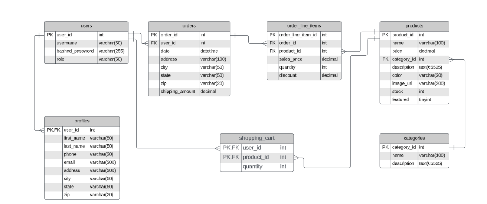
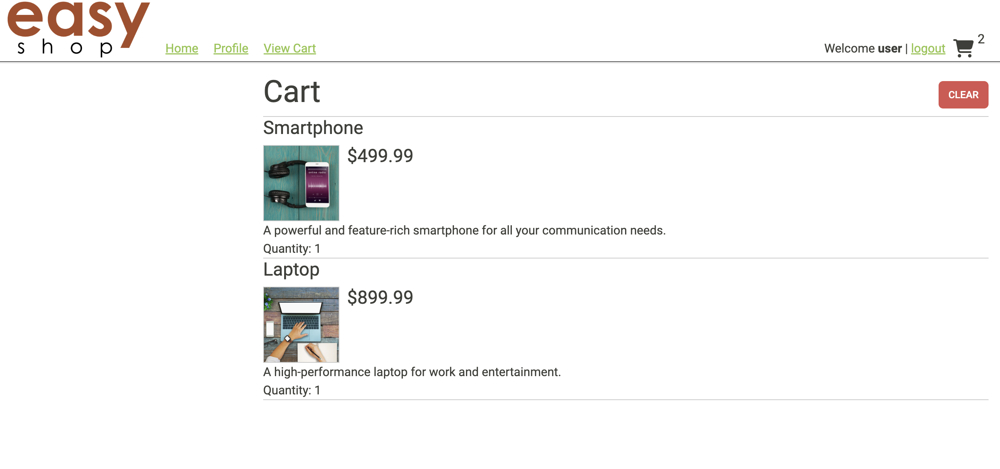

<p align="center" width="100%">
     
</p>

#### Welcome To EasyShop! This Application is a e-commerce store that utilizes Java Spring Boot as well as fullstack web development APIs 
## Table of Contents

- [Overview](#Overview)
- [Features](#features)
- [Favorite Code Snippet](#favorite-code-snippet)
- [Build Process](#build-process)
- [Authors](#authors-)
- [Links](#links)

## Overview

<p align="center" width="100%">
     
</p>

## SQL Database Creation & Structure

<p align="center" width="100%">
     
</p>

## EasyShop's HomePage allows users to easily choose to log-in and start browsing products

## Features

* Displays product details which include dedicated images, descriptions and prices
* Allows users to filter products with button sliders for price ranges and product categories
* Has versatility for admin users via their bearer token that allow them to modify, create, or delete products and categories
* Utilizes shopping cart functionality that holds user data of whatever product they choose to put into it
* Different users should be able to log in and maintain their shopping cart history

<p align="center" width="100%">
     
</p>

## Favorite Code Snippet

````
  @Override
    public void doFilter(ServletRequest servletRequest, ServletResponse servletResponse, FilterChain filterChain)
            throws IOException, ServletException {
        HttpServletRequest httpServletRequest = (HttpServletRequest) servletRequest;
        String jwt = resolveToken(httpServletRequest);
        String requestURI = httpServletRequest.getRequestURI();

        if (StringUtils.hasText(jwt) && tokenProvider.validateToken(jwt)) {
            Authentication authentication = tokenProvider.getAuthentication(jwt);
            SecurityContextHolder.getContext().setAuthentication(authentication);
            LOG.debug("set Authentication to custom security context for '{}', uri: {}", authentication.getName(), requestURI);
        } else {
            LOG.debug("no valid JWT token found, uri: {}", requestURI);
        }

        filterChain.doFilter(servletRequest, servletResponse);
    }

    private String resolveToken(HttpServletRequest request) {
        String bearerToken = request.getHeader(AUTHORIZATION_HEADER);
        if (StringUtils.hasText(bearerToken) && bearerToken.startsWith("Bearer ")) {
            return bearerToken.substring(7);
        }
        return null;
    }
````
Admin users generate a bearer token that allows them to utilize methods only available to them via the Spring Boot Annotation @PreAuthorize which checks the type of user that is logged-in

## Build Process

- Follow the [Intellij ](https://www.jetbrains.com/help/idea/your-first-spring-application.html) for getting started building a project Java Spring Boot.
- Clone or download the mysql workbench database
- `MySQL Workbench` to create database
- `Postman (Desktop App For Mac Users)` to run and test queries


## Authors 

Adrian San Miguel 

## Links

* [GitHub](https://github.com/asanmiguel12) 
* [LinkedIn](https://www.linkedin.com/in/adrianchristiansanmiguel/)
